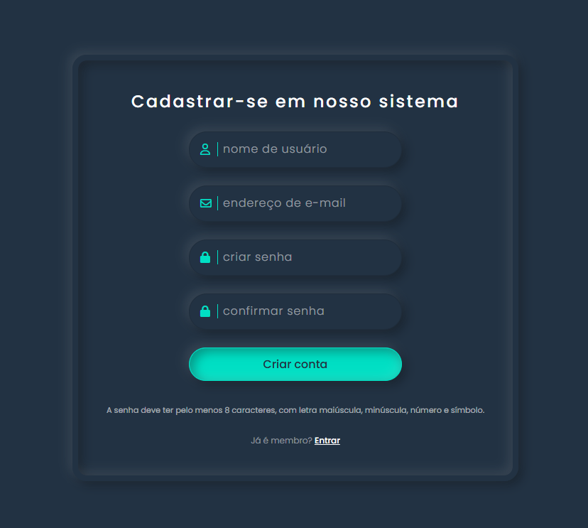

# Login Moderno com Validação de Senha em PHP

Interface de login e cadastro moderna, com animações suaves e validação de senha tanto no navegador quanto no servidor usando PHP.



## Descrição

Este projeto é uma tela de **login** e **cadastro de usuário** com visual moderno (neumorfismo), feita em HTML e CSS, com regras de senha aplicadas no front-end e no back-end (PHP).

No cadastro, a senha precisa atender a alguns requisitos de segurança, e o PHP confere tudo antes de aceitar o registro (simulado, sem banco de dados).

## Funcionalidades

- Tela de **cadastro** com campos de usuário, e-mail, senha e confirmação de senha.
- Tela de **login** com troca animada entre login/cadastro.
- **Validação de senha no navegador** (HTML5):
  - Pelo menos 8 caracteres.
  - Pelo menos uma letra maiúscula.
  - Pelo menos uma letra minúscula.
  - Pelo menos um número.
  - Pelo menos um símbolo (ex.: `! @ # $ %`).
- **Validação de senha no servidor (PHP)** com as mesmas regras.
- Verificação se as senhas coincidem e se o e-mail é válido.
- Exibição de mensagens de erro e mensagem de sucesso após o cadastro.

## Tecnologias usadas

- HTML5
- CSS3
- PHP 
- Font Awesome

## Como executar o projeto

1. Certifique-se de ter o **PHP** instalado na sua máquina.
2. Abra um terminal dentro da pasta do projeto `LoginModerno`.
3. Rode o servidor embutido do PHP:

   ```bash
   php -S localhost:8000
   ```

4. No navegador, acesse:

   ```
   http://localhost:8000/index.html
   ```

5. Teste o cadastro com diferentes senhas para ver as mensagens de validação.

## Estrutura de pastas

- `index.html` → Tela principal com formulários de login e cadastro.
- `style.css` → Estilos do layout moderno (cores, fontes, inputs, etc.).
- `signup.php` → Processa o formulário de cadastro e valida a senha no servidor.
- `image/README/1773622649436.png` → Imagem de demonstração usada no README.

